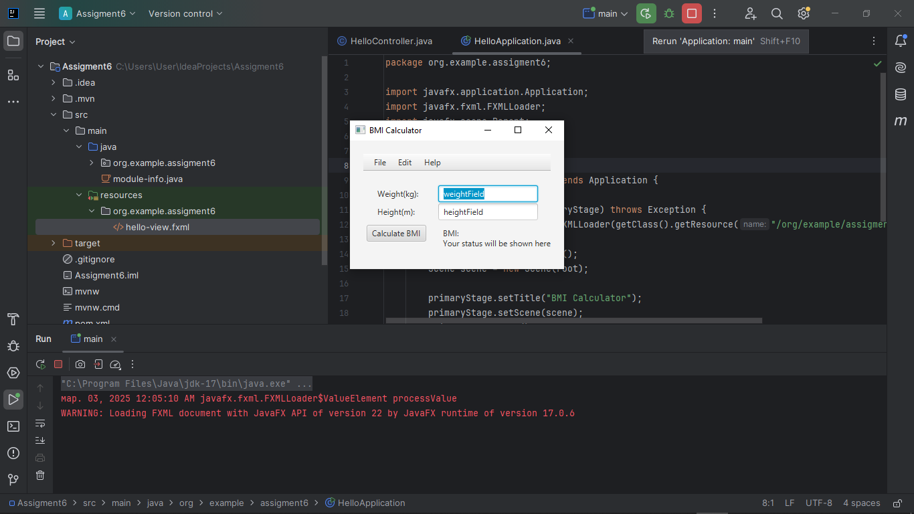
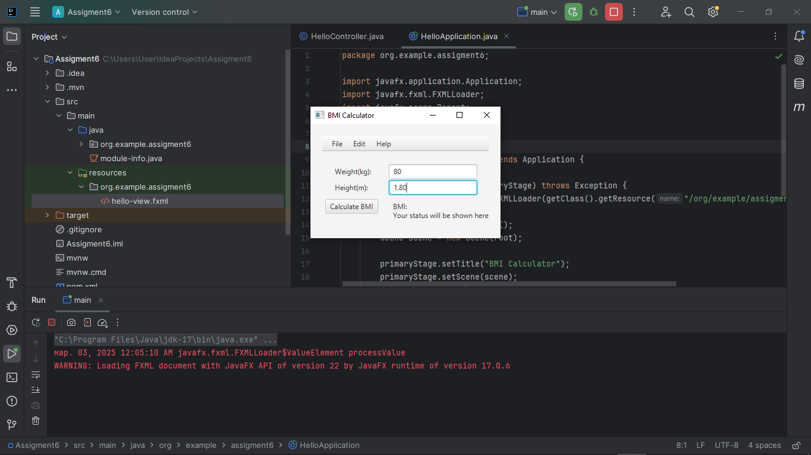
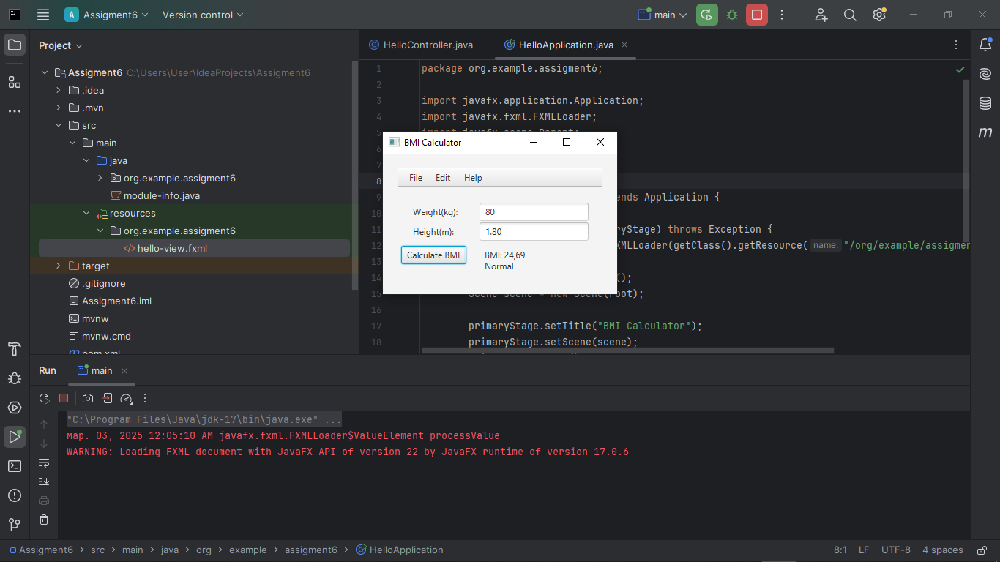
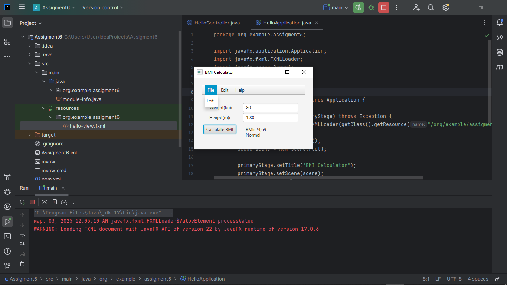
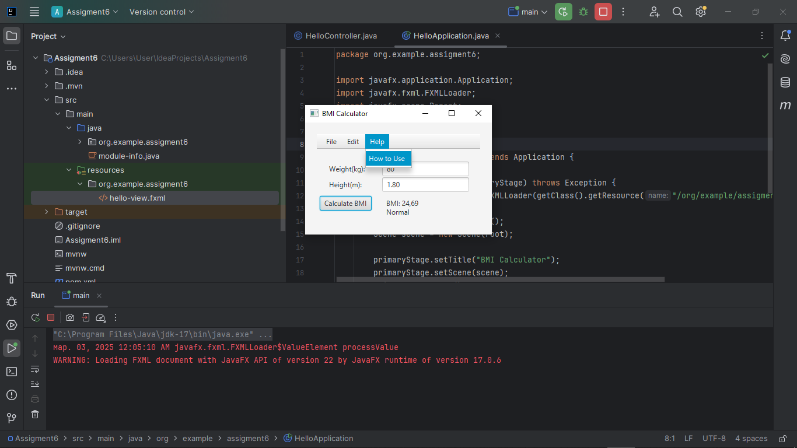

First, we created a new JavaFX project in IntelliJ IDEA and configured it to work with Scene Builder. Then we created an FXML file in which we used Scene Builder to place the main interface elements: text fields for entering weight and height, buttons for calculating and clearing, labels for displaying results, and a menu bar with the "File" and "Help" items. We added "Exit" to the menu, which closes the application, and "Clear" to clear the input fields.

Then we linked the FXML to the controller, adding fx:id for all elements that should interact with the code. We assigned the onAction method to the button so that when pressed, the BMI calculation is performed. In the controller, we created variables with the @FXML annotation to work with interface elements, and then wrote the calculateBMI() method, which receives the entered data, converts it to numbers, calculates the BMI using the formula weight / (height * height), determines the category (Underweight, Normal, Overweight, Obese) and displays the result in the label. We also implemented the clearFields() method, which clears the text fields when selecting the "Clear" item in the menu, and the exitApplication() method, which closes the application when selecting "Exit".

After that, we set up the main HelloApplication class, in which we loaded the FXML file via FXMLLoader, created a Scene and displayed a window. In main(), we simply called Application.launch() to launch the JavaFX application. As a result, the program successfully calculates the body mass index, shows the status and allows you to clear the fields or close the application via the menu.

Let me explain with screenshots the steps of the program

Step 1: We should run our code from our HelloApplication.java class and then we can see our main interface of our mini app

Step 2: We should input our data: weight in kg and height in meters like 1.80 m and click the Button for calculation BMI

Step 3: After clicking we can see that it has calculated our BMI and output our status like normal weight or not

Step 4: Also we have menuBar with File section and Exit function for exiting, clear function in Edit section to clear our inputs

Step 5: This section will help you how to use this App!
