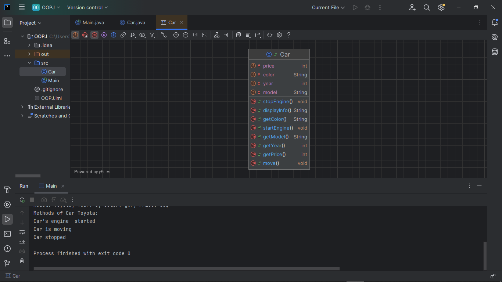

In this project i have created a class Car.

This code represents a class Car with four attributes:
model, year, color and price. First, we create a class Car
with a parameterized and default constructor
 and for each field we create getters and create a display 
info method to display all the details of the car and also
created three additional methods, that is,
 the car starts, moves and stops.Using a scanner we wrote a
program so that the user decides how many objects, i.e. cars,
he wants to create and using a cycle we write all the
descriptions for all the cars, how many the user wanted,
we put all the cars in a sheet and output all the methods
after each object.

